# Snapit - Social Media Platform

Welcome to Snapit! This is a social media platform built using React.js and several other libraries, allowing users to connect with others, share posts, and interact with the community.

Backend Live website - [Django rest framework](https://snapitapi-a9c9b5ffecd8.herokuapp.com/)
[GitHub repository](https://github.com/frirsta/snapitapi)

Live website - [Snapit](https://snapit-21abcde7984c.herokuapp.com/)
[GitHub repository](https://github.com/frirsta/snapit)

# Table of Contents

- [**Features**](#features)
- [**Technologies Used**](#technologies-used)
- [**Getting started**](#Getting-started)
- [**Sources**](#Sources)

 

Home page

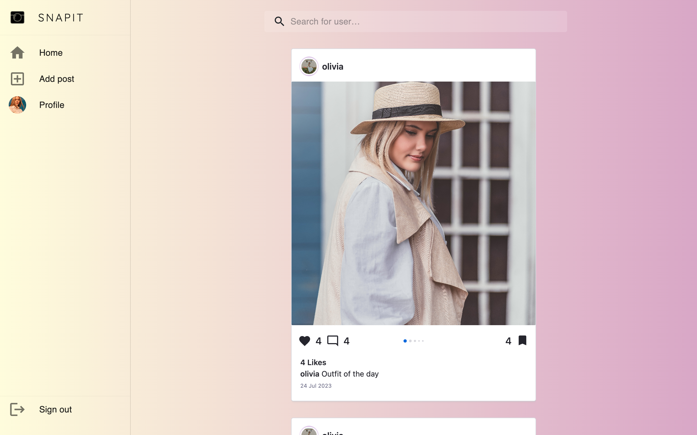
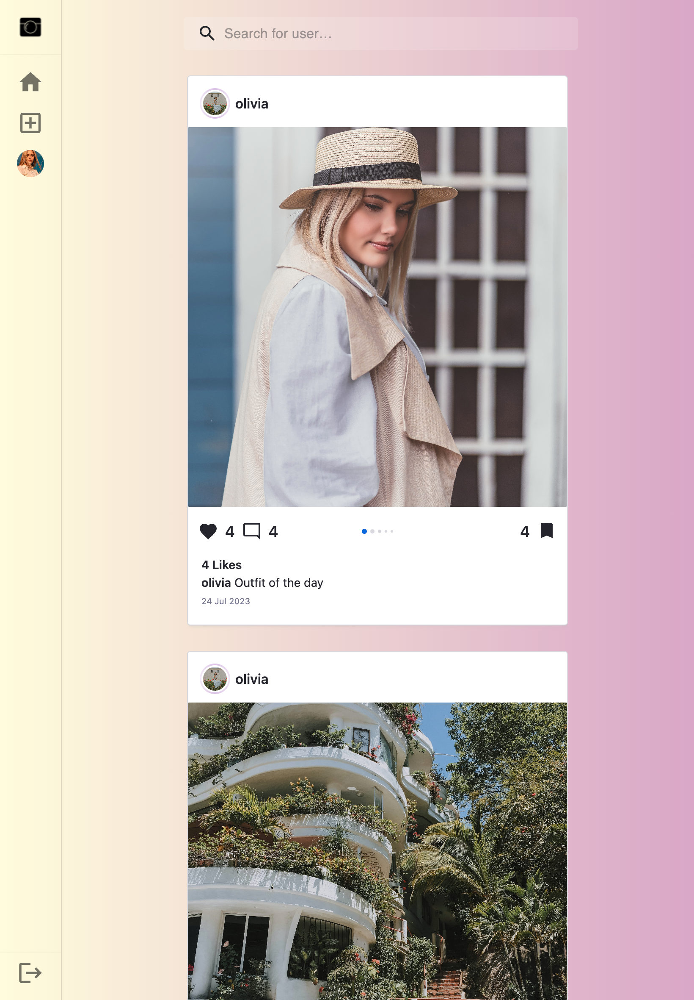
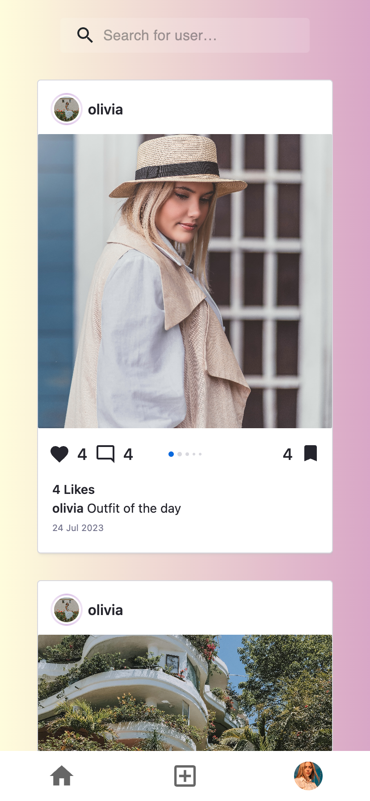

 

# Features

1. Sign Up / Sign In: Users can create an account or sign in to an existing account using their username and password.

 

Sign up page

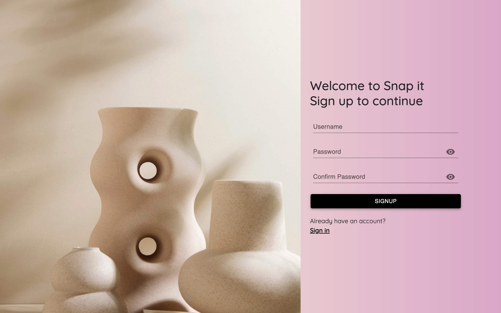
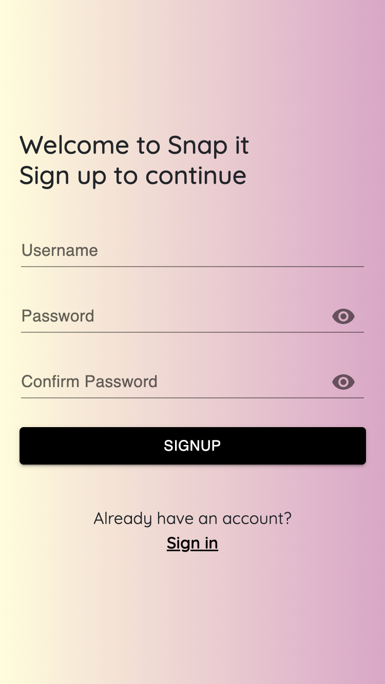

 

Sign in page

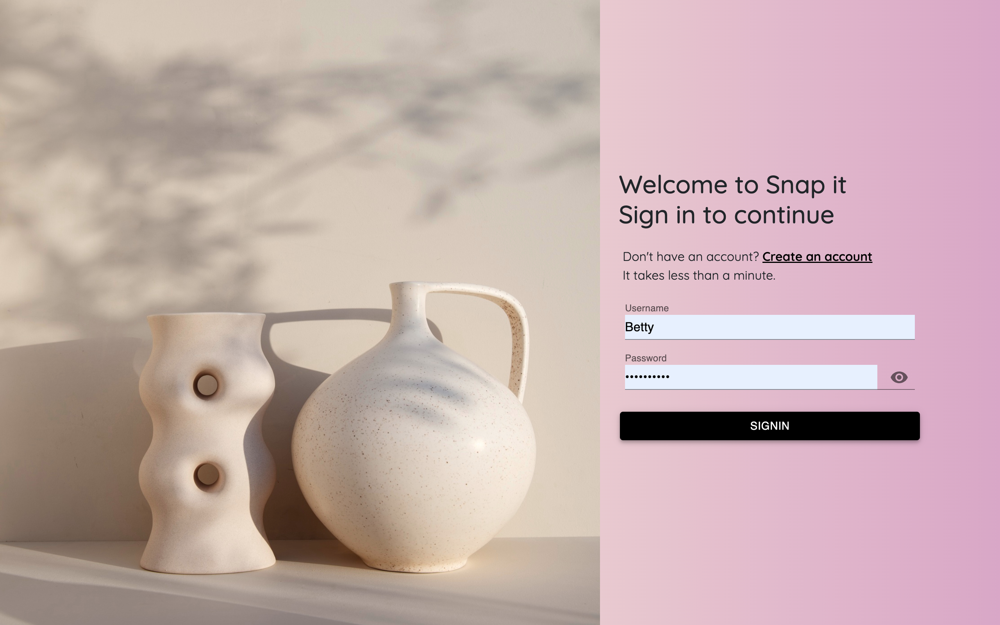
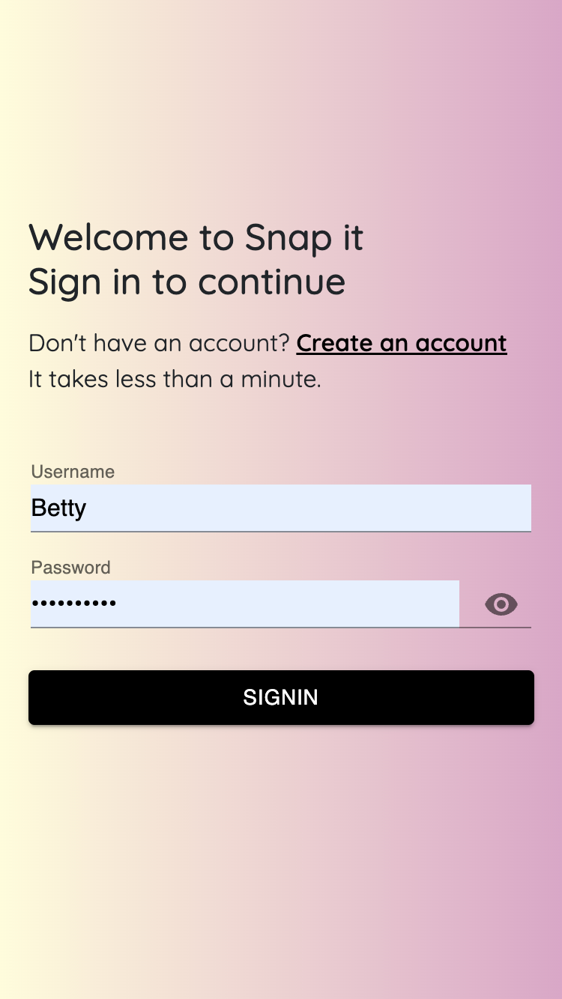

 

2. Add Posts: Authenticated users can create new posts and share their thoughts and images with the community.

 

Add post page

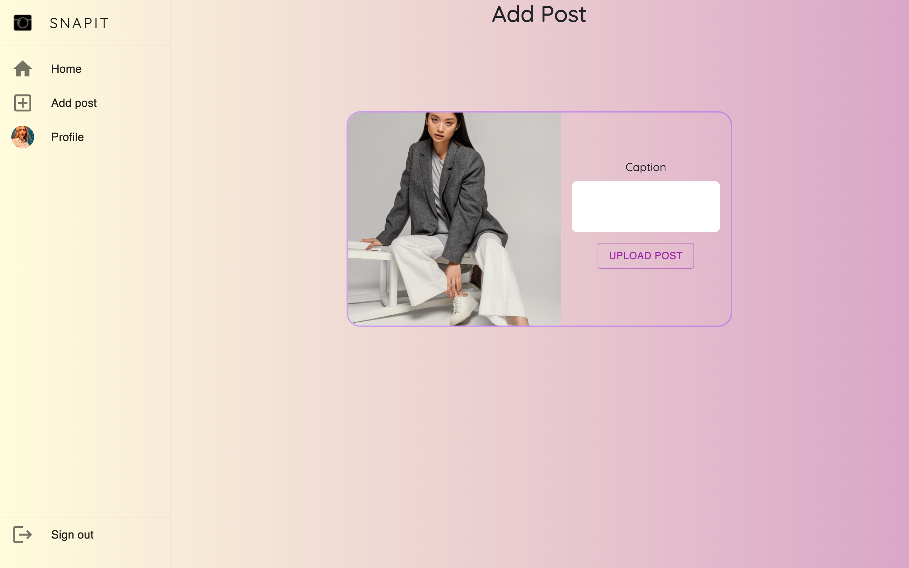
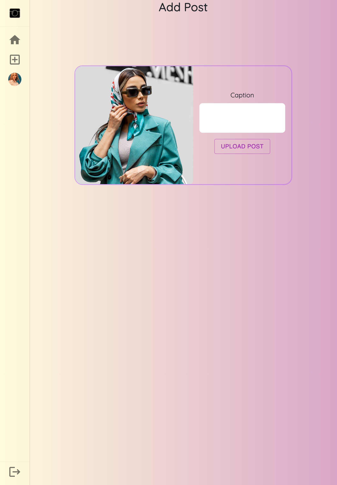
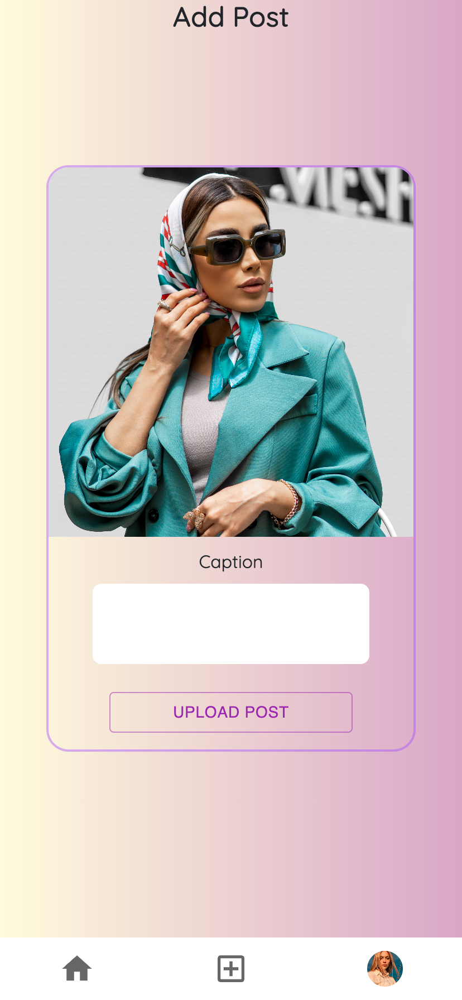

 

3. Edit Post: Users have the option to edit their own posts and update the content.

4. Comment Post: Users can comment on posts made by other users, promoting engagement and discussions within the community.

 

Comments

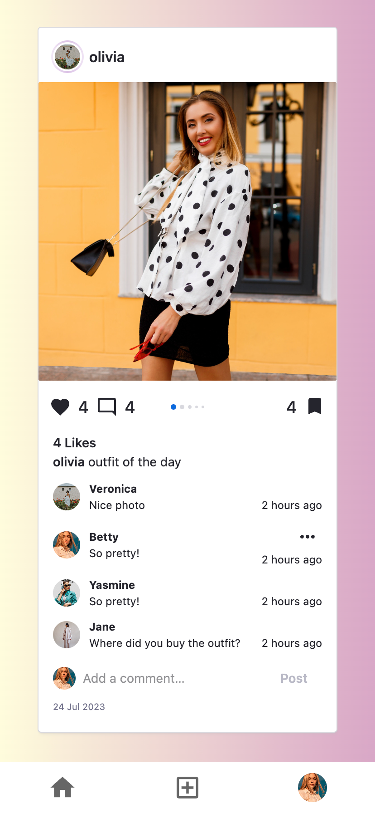

 

5. Delete Comments: Users can delete their own comments on any post.

6. Like Post: Users can like posts that they find interesting.

7. Save Post: Users can save posts they want to revisit later.

8. Follow Other Users: Users can follow other users.
    

Other user profile page

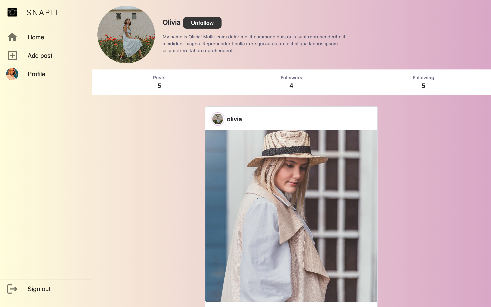
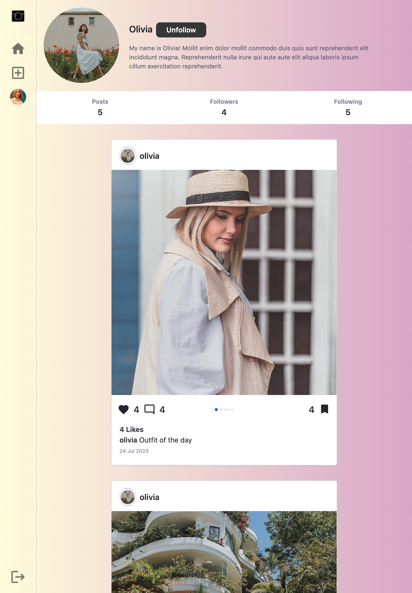
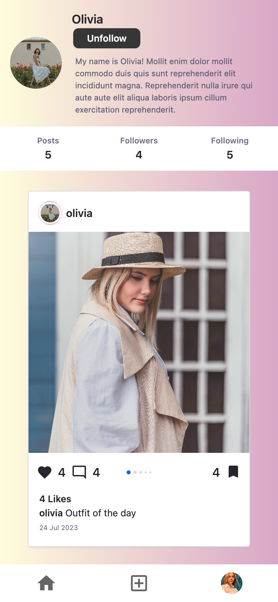

 

9. Profile Page: Each user has a dedicated profile page that showcases their profile image, bio, and various statistics:

- Total number of followers
- Total number of users they are following
- Total number of posts added by the user

 

Profile page

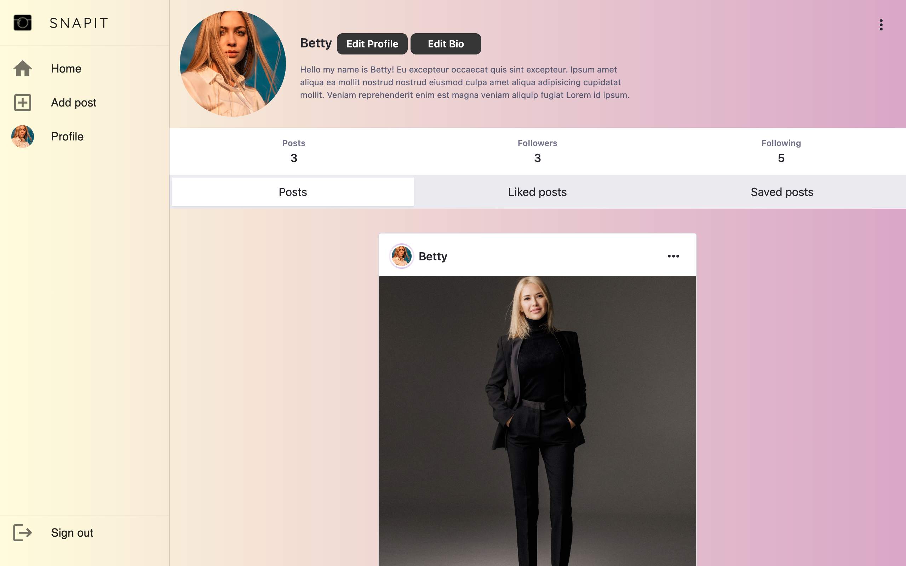
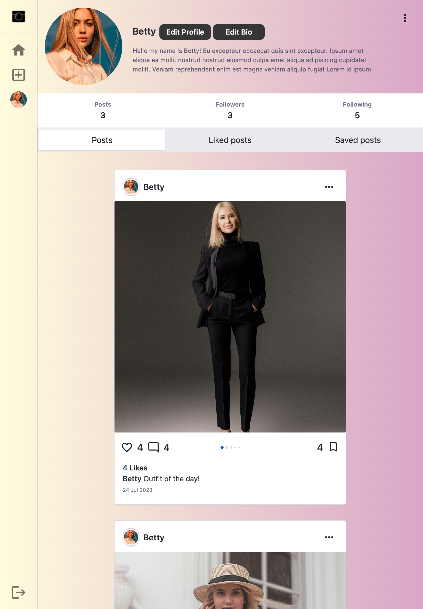
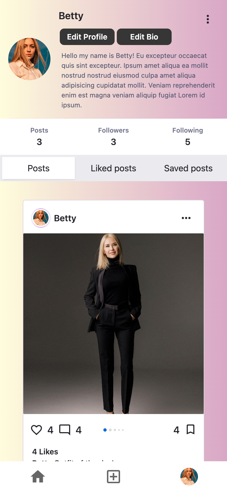

 

10. My Posts: Users can access a section on their profile page to find all the posts they have created.

11. Saved Posts: Users can access a section on their profile page to find all the posts they have saved.

12. Liked Posts: Users can access a section on their profile page to find all the posts they have liked.

# Technologies Used

- React.js
- React Router DOM
- Axios
- Material-UI (MUI)
- JWT Decode
- react-infinite-scroll-component
- React Bootstrap

# Sources

Sources

https://html-css-js.com/css/generator/box-shadow/

<a href="https://www.flaticon.com/free-icons/upload" title="upload icons">Upload icons created by Ilham Fitrotul Hayat - Flaticon</a>

<a href="https://www.flaticon.com/free-icons/picture" title="picture icons">Picture icons created by Pixel perfect - Flaticon</a>

Sign up page
<a href="https://www.freepik.com/free-photo/still-life-with-modern-vases-soft-aesthetics_31587722.htm#from_view=detail_serie">Image by pikisuperstar</a> on Freepik

Sign in image
Image by <a href="https://www.freepik.com/free-photo/minimal-white-vases-arrangement_31589984.htm#&position=0&from_view=collections">Freepik</a>

icon
<a href="https://www.freepik.com/icon/action-camera_4369085#position=6&page=1&term=camera+logo&fromView=search">Icon by IconMarketPK</a>

Video av <a href="https://pixabay.com/sv/users/felixmittermeier-4397258/?utm_source=link-attribution&utm_medium=referral&utm_campaign=video&utm_content=91545">PayPal.me/FelixMittermeier</a> från <a href="https://pixabay.com/sv//?utm_source=link-attribution&utm_medium=referral&utm_campaign=video&utm_content=91545">Pixabay</a>

Images
<a href="https://www.freepik.com/free-photo/beautiful-tree-middle-field-covered-with-grass-with-tree-line-background_13005861.htm#query=nature&position=2&from_view=search&track=sph">Image by wirestock</a> on Freepik

